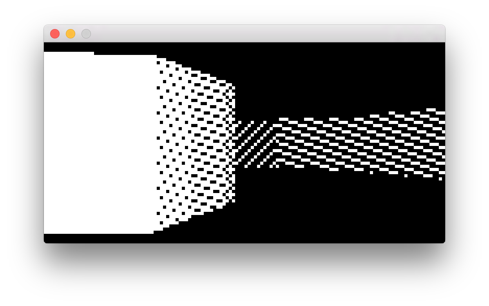

# walls3duino
This is a "port" of the [walls3d](https://github.com/jiganerd/walls3d) program to the Arduino Uno platform. It requires a 128x64 OLED display and a SparkFun Joystick Shield - or at least some buttons wired - for movement.

## Building and Running

### ... on Arduino
Open walls3duino.ino in the Arduino IDE. Before building and deploying, you likely will have to change the "0x3C" argument in the call to the SSD1306 display driver's begin() function to "0x3D" (or remove the argument altogether to use the default value). I happened to use an atypical 128x64 OLED display which uses 0x3C as the I2C starting address - typically, 0x3D is the starting address for 128x64 displays and 0x3C is the starting address for 128x32 displays.

The OLED display should be wired to the Arduino's I2C pins, and the joystick shield should be connected. Deploy to the Arduino as normal and use the joystick shield's buttons (not the joystick) for movement.

### ... on a PC

This program can also be run in a "simulation mode" on a Mac or Windows PC. (Yes, technically, a Mac *is* a PC!) I started developing this software on a Mac with no access to my Arduino hardware, so this feature was a big help. There are project files included for both XCode 7.2.1 and Visual Studio 2017. (See if you can find them all!) You can use the arrow keys on the keyboard for input.

If you would like to build and run in a different PC environment, it is important to note that a) this simulation mode makes use of the [Simple DirectMedia Layer (SDL) 2 cross-platform library](https://www.libsdl.org/) for the graphical output and keyboard input, b) source files inside the SDLSim folder are used instead of the .ino file, and c) there is a macro called SDLSim which must be defined in the call to the compiler (e.g. "... -DSDLSim"). (You can see "SDLSim" control some logic in a couple of files which are common to both the embedded and PC versions.)

## Creating Maps

You can create your own maps by using a 2D CAD program which can save .dxf files, such as [LibreCAD](https://librecad.org/), and using the original walls3d program to convert a .dxf file to C/C++ array code to be built into the walls3duino program. This is currently a matter of commenting/uncommenting code in the walls3d program, which is not ideal, but it works. (If anyone wants to edit the walls3d program to instead take command line arguments for this sort of thing, please do!) The C/C++ code output from walls3d can be pasted into BspTreeBin.cpp for use in walls3duino.

Note that RAM is very tight, and the maps should be designed accordingly... I think there are only a few bytes available with the built-in default map! If you want to make a bigger map, take a look at the TODO list below...

## Design Notes

There are a few "tricks" and things here that I thought were worth noting and which might be interesting to someone.

The original version of walls3d included features such as texture mapping, an overhead map, and saving/loading a map to/from a .dxf file, which were removed from this version, for hopefully-obvious reasons. Aside from the graphical limitations of the low-resolution black and white display, the Arduino is limited in processing power, and especially RAM - the Arduino Uno only has 2 KB RAM, which was probably the most challenging limitation. There was also the limitation that the standard C++ library is not available on the standard Arduino platform (and the original codebase makes use of things like std::vector).

I originally wanted to see if I could just get the raycasting version of the renderer from the walls3d program working on the Arduino. This renderer is very simple, but very inefficient - it simply casts a "ray" out into the "world" for each column of pixels on the screen, compares to *all* walls, and looks for the closest intersection. This worked, but it ran at only about 3 frames per second.

I then tried getting the [Binary Space Partitioning (BSP)](https://en.wikipedia.org/wiki/Binary_space_partitioning) renderer working in the hopes of getting a higher frame rate, but quickly ran out of RAM in the stage that creates the BSP tree at startup. After trying various things, I decided to give up on the idea of the Arduino creating the tree at startup, and instead had the tree "pre-compiled" on a PC, using the walls3d program. This "pre-compiled" BSP tree is read out of the Arduino's flash memory during startup. This idea of pre-building the BSP tree, outside of the end-user program, is actually similar to how Doom worked.

Due to early problems with running out of RAM due to deep recursion while creating the BSP tree, I moved away from recursion for even reading the tree out of flash. The recursive approach would put a number of big 16-bit pointers and things on the call stack for each function call - instead, I used a single loop with a very-compact manually-manipulated stack class. The data structure used in this stack uses 8-bit index integers instead of 16-bit pointers in order to keep things small. (But this also imposes limitations on the number of BSP nodes allowed.) I am actually not totally convinced that this "no recursion" approach is still completely necessary, though, due to changes elsewhere, but it works, and keeps things nice and known/bounded (which is good for an embedded system).

Once the BSP renderer was working, the frame rate was noticeably better, at around 10 frames per second, which was pretty satisfactory to me. But it is also still relatively simple to re-enable the raycasting renderer if anyone wants to play around with that.

This program uses a "hacked" version of the Adafruit SSD1306 graphics driver for the OLED display. The following changes were made:
* The full frame buffer (1 KB) was removed in order to save RAM, and replaced with a simple single-column buffer (only 8 bytes). (Some drawing functionality that was originally built into the driver is lost, but this functionality is not used by this program.)
* Along with the above, the display module is configured for a vertical addressing mode (0x01), as found in the SSD1306 datasheet, which allows entire columns can be drawn one at a time. This is more in alignment with the way the rendering algorithms work. (Otherwise, we must draw horizontally across the screen before drawing lower parts of a given column.)
As with many software decisions, this implies a tradeoff - RAM is saved, but with no full-screen frame buffer, the horizontal drawing "sweep" across the screen can be seen. But, this is "not that bad" visually, and worth the RAM savings. If, in the future, someone wanted to add sprites like enemies, a player gun, etc. - anything other than walls - this would probably pose a problem, and someone might have to think up more tricks...

Since the pixels in the display can only be on or off, simple dithering patterns are used to represent diminished lighting. (Farther away walls seem darker than closer walls.) These are very simple 1-dimensional 8-bit patterns, used  when drawing a column. 

## TODO

Here are some thoughts for future enhancements:
* The line/wall data structures could be more compact. Each line/wall currently stores two full vertices - instead, there could be a global list of vertices, and the line/wall data structures could contain only indices to the list to represent connections. This would free up more RAM for bigger maps, etc. (Might be a big refactor!)
* Lookup tables could be used for trig. functions to speed things up.
* Fixed-point representations of coordinates could be investigated again - I tried this early on and actually found that it slowed things down due to converting to and away from floating point for use in trig. functions. Maybe these topics could be investigated together.
* It could be attempted to enable larger maps by keeping the BSP tree in flash instead of RAM, in the same format as it is currently in RAM, if the flash reading speed would allow for it. 
* The flat "height buffer" could be changed to a more "compressed" array, with each item representing a "from x to x" segment that has been drawn, similar to the Doom engine, in case it speeds up checking whether or not the entire screen has been drawn.
